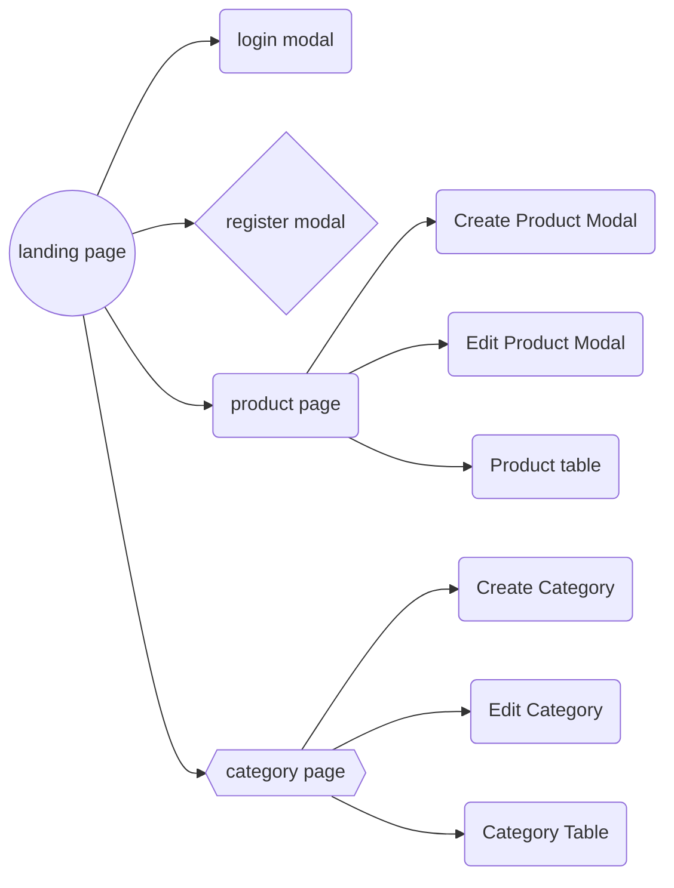

## Project Name
Etranzact Shop

## About the project

## Core Technologies

- [REACT JS](https://react.dev/learn)
- [TAILWINDCSS](https://tailwindcss.com/)
- [REDUX TOOLKIT]()
- [REACT QUERY]()
- [REDUX PERSIST]()
- [REACT HOOK FORM]()
- [REACT FORMIK]()
- [REACT TABLE]()
- [REACT SELECT]()
- [LODASH]()
- [HEADLESS UI](https://headlessui.com/react)
  
## How to start on local

## Web URL


## API BaseURL


## Project Tasks

- [ ] Set up UI components
- [ ] Set up local state management
- [ ] set up server state management
- [ ] set up absolute importing
- [ ] set up environment variables
- [ ] tailwindcss form, tailwindcss prettier, debug-screen

## Assignment
- Husky and Lint-staged

## PROJECT FLOW


```
<div></div>
```